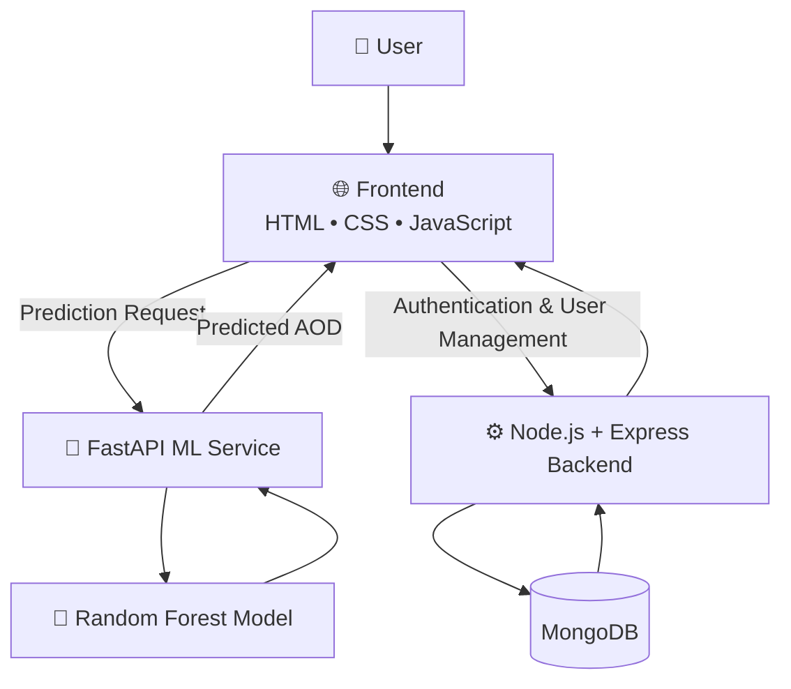
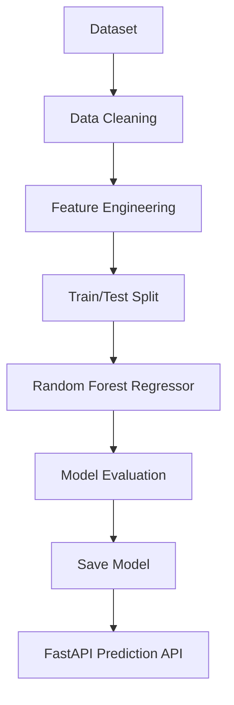
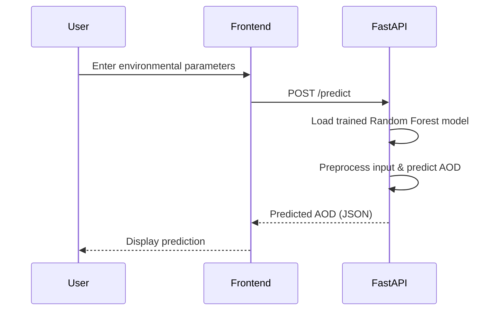

<h1 align="center">🌍 AOD Predictor</h1>

<h3 align="center">
Full-Stack Machine Learning Application for Aerosol Optical Depth Prediction
</h3>

<p align="center">
Predicting Aerosol Optical Depth (AOD) using Machine Learning with a scalable Full-Stack Architecture.
</p>

<p align="center">


</p>

---

# 📖 About The Project

**AOD Predictor** is a Full-Stack Machine Learning application developed as a **B.Tech Final Year Project** to predict **Aerosol Optical Depth (AOD)** using environmental parameters.

The project combines

- 🌐 Responsive Web Application
- ⚙️ Node.js REST API
- 🤖 FastAPI Machine Learning Service
- 🌲 Random Forest Regression Model

to provide fast and reliable predictions for environmental monitoring and atmospheric research.

---

# 🎯 Motivation

Aerosol Optical Depth (AOD) plays an important role in

- 🌍 Air Quality Monitoring
- ☁️ Climate Change Studies
- 🌦 Weather Forecasting
- 🛰 Remote Sensing
- 🔬 Environmental Research

Traditional AOD estimation requires expensive instruments and satellite processing.

This project demonstrates how Machine Learning can estimate AOD efficiently using environmental features.

---

# ✨ Features

- 🌍 Predict Aerosol Optical Depth
- 🤖 Machine Learning Prediction Engine
- ⚡ FastAPI Prediction API
- 🌐 Node.js + Express Backend
- 💻 Interactive Frontend
- 📈 Real-Time Prediction
- 🔗 Modular Full-Stack Architecture
- 🚀 Easy Deployment
- 📦 RESTful APIs
- 🛠 Clean Project Structure

---

# 🏗️ System Architecture



### Architecture Overview

The project follows a modular architecture with independent services:

- **Frontend** provides the user interface and collects prediction inputs.
- **FastAPI** hosts the trained Machine Learning model and performs AOD predictions.
- **Node.js + Express** handles user authentication, authorization, and user management.
- **MongoDB** stores user accounts and authentication-related data.
- The prediction service and authentication service are independent, making the system easier to maintain and scale.

# 🧠 Machine Learning Pipeline



---

# 🛠 Tech Stack

## Frontend

- HTML5
- CSS3
- JavaScript

---

## Backend

- Node.js
- Express.js

---

## Machine Learning

- Python
- Scikit-Learn
- FastAPI
- Pandas
- NumPy
- Joblib
- Uvicorn

---

## Tools

- Git
- GitHub
- VS Code

---

# 📂 Project Structure

```text
AOD-PREDICTOR
│
├── frontend
│
├── backend
│
├── aodModel
│
├── README.md
│
└── package.json
```

---

# 🔄 Prediction Workflow



---

# 📊 Model Information

| Property | Value |
|----------|--------|
| Problem Type | Regression |
| Algorithm | Random Forest Regressor |
| Language | Python |
| Framework | Scikit-Learn |
| API | FastAPI |
| Backend | Node.js |
| Frontend | HTML, CSS, JavaScript |

---

# 🚀 Installation

## Clone Repository

```bash
git clone https://github.com/prajyoth2006/AOD-PREDICTOR.git

cd AOD-PREDICTOR
```

---

## Backend

```bash
cd backend

npm install

npm start
```

---

## Machine Learning Server

```bash
cd aodModel

pip install -r requirements.txt

uvicorn main:app --reload --port 2000
```

---

## Frontend

```bash
cd frontend

npm install

npm start
```

---

# 🌍 Applications

- Air Quality Monitoring
- Climate Change Research
- Atmospheric Science
- Pollution Analysis
- Environmental Monitoring
- Academic Research

---

# 🚀 Future Improvements

- Deep Learning Models
- XGBoost & LightGBM
- Explainable AI (SHAP)
- Docker Support
- CI/CD Pipeline
- Kubernetes
- AWS Deployment
- Live Weather API
- Prediction Dashboard
- Interactive Charts
- GIS Integration

---

# 🤝 Contributing

Contributions are always welcome.

1. Fork the repository

2. Create a feature branch

```bash
git checkout -b feature-name
```

3. Commit your changes

```bash
git commit -m "Add new feature"
```

4. Push the branch

```bash
git push origin feature-name
```

5. Open a Pull Request

---

# 📄 License

This project is licensed under the **MIT License**.

---

# 👨‍💻 Developer

**M. Prajyoth**

B.Tech Civil Engineering

Indian Institute of Technology Patna

<p>

<a href="https://github.com/prajyoth2006">

</a>

<a href="https://linkedin.com/in/mprajyoth">

</a>

<a href="mailto:prajyoth2006@gmail.com">

</a>

</p>

---

<p align="center">

⭐ If you like this project, consider giving it a Star!

Made with ❤️ by <b>M. Prajyoth</b>

</p>
